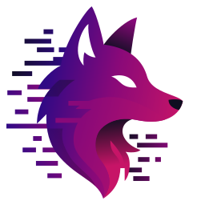

<div align="center">
  
  
  # Vulfram
  
  **High-Performance Rendering & Systems Core powered by WebGPU**
  
  [](LICENSE.md)
  [](https://www.rust-lang.org/)
</div>

---

## 📋 Table of Contents

- [About Vulfram](#-about-vulfram)
- [Design Philosophy](#-design-philosophy)
- [Architecture](#️-architecture)
- [Key Concepts](#-key-concepts)
- [Quick Start](#-quick-start)
- [Main Features](#-main-features)
- [Development](#️-development)
- [Project Structure](#-project-structure)
- [Documentation](#-documentation)
- [Contributing](#-contributing)
- [License](#-license)
- [About Vulppi](#-about-vulppi)

---

## 🦊 About Vulfram

**Vulfram** is a **rendering and systems core** written in Rust and exposed as a dynamic library. The name combines "Vulppi" (derived from _Vulpes_, the scientific name for fox) and "Frame", representing our mission to create perfect frames for incredible interactive experiences.

Vulfram is designed to be **host-agnostic** and driven by external runtimes via FFI:

- 🟢 **Node.js** (N-API)
- 🌙 **Lua** (via `mlua`)
- 🐍 **Python** (via `PyO3`)
- 🔧 Any environment capable of calling C-ABI functions

### Core Features

- 🚀 **High Performance**: GPU-accelerated rendering with WGPU (WebGPU)
- 🔄 **Cross-Platform**: Native support for Windows, macOS, and Linux
- 🎮 **Complete Input System**: Keyboard, mouse, touch, and gamepads (via Gilrs)
- 🪟 **Advanced Window Management**: Full control over multiple windows (via Winit)
- 💡 **Lighting & Shadows**: Support for various light types and shadow mapping
- 🎨 **Materials & Textures**: Flexible resource management for rendering
- 🔌 **Language Bindings**: N-API (Node.js), Lua, Python, and more. With C-ABI, `bun:ffi` is also possible.
- ⚡ **MessagePack Communication**: Fast binary serialization for commands and events
- 🎯 **Host-Agnostic Design**: No assumptions about ECS, OOP, or game framework

---

## 💡 Design Philosophy

Vulfram follows a **black box** approach where:

> The host controls the engine **only** through:
>
> - A small set of C functions (`vulfram_*`)
> - Binary buffers serialized with **MessagePack**

**Design Goals:**

- **Host-agnostic**: Works with any game framework or architecture
- **Minimal public surface**: Only essential C-ABI functions exposed
- **Binary and fast**: MessagePack for structured data, raw bytes for heavy assets
- **Clear separation**: Host manages logic and IDs, Core manages GPU and rendering

---

## 🏗️ Architecture

Vulfram uses a queue-based architecture that enables efficient communication between the host and the Rust core:

```
┌─────────────────────────────────────┐
│          Host Layer                 │
│  (JS/TS, Lua, Python, etc.)         │
│  • Game Logic                       │
│  • Entity Management                │
│  • ID Generation                    │
└────────┬────────────┬───────────────┘
         │            │
         │ Commands   │ Events
         │ (MsgPack)  │ (MsgPack)
         ▼            ▲
    ┌────────────────────────────┐
    │  vulfram_send_queue()      │
    │  vulfram_receive_queue()   │
    │  vulfram_receive_events()  │
    │  vulfram_upload_buffer()   │
    │  vulfram_tick()            │
    └──────────┬─────────────────┘
               │
┌──────────────▼───────────────────────┐
│        Vulfram Core (Rust)           │
│  • Resource Management               │
│  • Component Instances               │
│  • Window Management (Winit)         │
│  • GPU Rendering (WGPU)              │
│  • Input Processing (Gilrs)          │
└──────────────┬───────────────────────┘
               │
┌──────────────▼───────────────────────┐
│           GPU Layer                  │
│  Vulkan / Metal / DirectX 12         │
└──────────────────────────────────────┘
```

### Responsibilities

**Host (Your Game/App):**

- Manage game logic and world state
- Generate logical IDs (entities, resources, buffers)
- Build MessagePack command batches
- Drive the main loop with `vulframTick()`
- Process events and messages

**Vulfram Core:**

- Abstract window, input, and rendering systems
- Manage GPU resources and pipelines using WGPU
- Track component instances (cameras, models, etc.)
- Translate commands into internal state changes
- Render frames efficiently

---

## 🔑 Key Concepts

### Components vs Resources

Vulfram distinguishes between two fundamental types:

**Components** - High-level structures describing scene participation:

- Always attached to an `ComponentId`
- Examples: `CameraComponent`, `ModelComponent`, `LightComponent`
- Can contain static data (local colors, matrices)
- Reference sharable resources by logical ID
- Created/updated via MessagePack commands

**Resources** - Reusable assets used by components:

- Identified by logical IDs: `ShaderId`, `GeometryId`, `MaterialId`, `TextureId`
- Sharable across multiple components/entities
- Have internal GPU handles (buffers, textures, pipelines)
- Examples: Shaders, geometries, textures, materials, samplers

### Logical IDs

The host manages all logical identifiers:

- `ComponentId` - Identifies scene entities
- `ShaderId` - Shader programs
- `GeometryId` - Mesh/geometry assets
- `MaterialId` - Material configurations
- `TextureId` - Texture assets
- `BufferId` - Upload/download blob identifiers

These are opaque integers to the core. The host ensures uniqueness and consistency.

### Layer Masking

Vulfram uses `u32` bitmasks for visibility control:

- `layerMaskCamera` - Specifies which layers a camera can see
- `layerMaskComponent` - Specifies which layers a model belongs to
- `layerMaskLight` - (Future) Which layers a light affects

**Visibility Rule:**

```text
Visible if: (layerMaskCamera & layerMaskComponent) > 0
```

This enables:

- World-only or UI-only cameras
- Team-based rendering
- Debug geometry filtering
- Multi-pass rendering strategies

### Upload System

Heavy data uses one-shot uploads:

1. Host calls `vulframUploadBuffer(bufferId, type, data)`
2. Core stores blob in internal upload table
3. `Create*` commands reference `bufferId` to consume data
4. Entry is marked as used and can be removed
5. `DiscardUnusedUploads` command cleans up unused entries

---

## 🚀 Quick Start

### Prerequisites

- **Rust** 1.70+ ([rustup.rs](https://rustup.rs/))
- **Vulkan**, **Metal**, or **DirectX 12** updated drivers

### Quick Start (Core Test Harness)

```bash
# Clone the repository
git clone https://github.com/vulppi-dev/vulfram.git
cd vulfram

# Build and run the test harness
cargo run
```

The test harness lives in `src/main.rs` and exercises:

- window creation
- primitive geometry creation
- camera + model setup
- basic rendering loop

---

## 📚 Main Features

### Window Management

- Multiple window creation and management
- Window state control (normal, minimized, maximized, fullscreen)
- Position and size configuration
- Borderless and resizable options
- Custom window icons and cursors
- Drag-and-drop file support
- Window events (resize, move, focus, close)

### Input System

- **Keyboard**: Physical key events with modifiers and IME support
- **Mouse**: Movement, buttons, scroll wheel
- **Touch**: Multi-touch support with gestures (pinch, pan, rotate)
- **Pointer**: Unified API for mouse/touch/pen via `PointerEvent`
- **Gamepad**: Automatic detection, buttons, analog sticks, triggers
  - Standard mapping with dead zones
  - Change threshold filtering for efficient event generation

### Rendering (WGPU)

- GPU-accelerated rendering via WebGPU
- Cross-platform support (Vulkan, Metal, DirectX 12)
- Buffer upload/download for textures and meshes
- Efficient CPU-GPU synchronization
- Component-based rendering system
- Layer-based visibility control

### Communication

- **MessagePack** serialization for fast binary communication
- Separate queues for:
  - Commands (host → core)
  - Messages (core → host)
  - Events (core → host)
- Profiling data export for performance analysis

### Performance Optimizations

- **Event caching**: Filters duplicate events to reduce overhead
- **Redraw optimization**: Dirty flag system for selective rendering
- **Dead zone filtering**: Reduces gamepad noise
- **Batch processing**: Commands processed in bulk for efficiency

---

## 🛠️ Development

```bash
# Build Rust core
cargo build --release

# Run tests
cargo test

# Check code with Clippy
cargo clippy

# Format code
cargo fmt
```

### Recommended Development Loop

```text
1. Update host-side logic (game state, entities)
2. Upload heavy data (optional) via vulframUploadBuffer()
3. Send command batch via vulframSendQueue()
4. Advance the core via vulframTick(time, deltaTime)
5. Receive messages via vulframReceiveQueue()
6. Receive events via vulframReceiveEvents()
7. Read profiling data (optional) via vulframProfiling()
```

---

## 📦 Project Structure

```
vulfram/
├── src/                       # Rust core
│   ├── lib.rs                # Crate entry point (cdylib)
│   └── core/                 # Engine core modules
│       ├── mod.rs            # Core module exports
│       ├── buffers.rs        # Buffer management
│       ├── handler.rs        # Command handling
│       ├── lifecycle.rs      # Init/dispose lifecycle
│       ├── queue.rs          # Message/command queues
│       ├── result.rs         # Result types
│       ├── singleton.rs      # Global state management
│       ├── state.rs          # Engine state
│       ├── tick.rs           # Frame update logic
│       ├── cache/            # Event caching system
│       │   ├── gamepad.rs    # Gamepad state cache
│       │   ├── input.rs      # Input state cache
│       │   └── window.rs     # Window state cache
│       ├── cmd/              # Command system
│       │   ├── events/       # Event command handlers
│       │   └── win/          # Window command handlers
│       └── render/           # Rendering system
│           ├── state.rs      # Render state management
│           └── mod.rs        # Render module exports
│
├── docs/                      # Documentation
│   ├── OVERVIEW.md           # High-level overview
│   ├── ABI.md                # C-ABI specification
│   ├── ARCH.md               # Architecture & lifecycle
│   ├── API.md                # Internal Rust API
│   ├── GLOSSARY.md           # Terminology reference
│   ├── MASCOT-DEFINITION.md  # Mascot guidelines
│   └── UI.md                 # UI design guidelines
│
├── assets/                    # Visual resources
│   └── brand.svg             # Vulfram logo
│
├── Cargo.toml                 # Rust dependencies
└── README.md                  # This file
```

---

## 📖 Documentation

Comprehensive documentation is available in the `docs/` folder.

### 📑 [Documentation Index](docs/INDEX.md)

**Not sure where to start?** Check our [complete documentation index](docs/INDEX.md) for guided navigation based on your role and needs.

### Quick Links

**For Engine Users (Binding Authors):**

1. **[OVERVIEW.md](docs/OVERVIEW.md)** - Start here! High-level concepts and design philosophy
2. **[ABI.md](docs/ABI.md)** - C-ABI functions, usage contract, and calling conventions
3. **[ARCH.md](docs/ARCH.md)** - Architecture, lifecycle, and main loop patterns
4. **[GLOSSARY.md](docs/GLOSSARY.md)** - Terminology and naming conventions

**For Core Contributors (Rust Developers):**

1. **[OVERVIEW.md](docs/OVERVIEW.md)** - Core concepts and design
2. **[ARCH.md](docs/ARCH.md)** - System architecture
3. **[API.md](docs/API.md)** - Internal Rust API, crates, and data structures
4. **[GLOSSARY.md](docs/GLOSSARY.md)** - Internal terminology

**Additional Resources:**

- **[MASCOT-DEFINITION.md](docs/MASCOT-DEFINITION.md)** - Brand mascot guidelines
- **[UI.md](docs/UI.md)** - User interface design guidelines
- **[Copilot Instructions](.github/copilot-instructions.md)** - Development patterns and memory

---

## 🤝 Contributing

Contributions are welcome! Please follow these guidelines:

### Code Style

- **Rust code**: Minimal comments, self-descriptive names
- **All code**: English for variables, functions, types, and comments
- **Documentation**: English for all docs (README, API docs)
- **Communication**: Brazilian Portuguese for discussions and issues

### Development Process

1. Fork the project
2. Create a feature branch (`git checkout -b feature/MyFeature`)
3. Follow the project's coding conventions (see `.github/copilot-instructions.md`)
4. Write tests for your changes
5. Ensure all tests pass (`cargo test`)
6. Format your code (`cargo fmt`)
7. Check for issues (`cargo clippy`)
8. Commit your changes (`git commit -m 'Add MyFeature'`)
9. Push to your branch (`git push origin feature/MyFeature`)
10. Open a Pull Request

### Architecture Guidelines

- Keep the C-ABI surface minimal
- Use MessagePack for all structured data crossing the ABI
- Maintain clear separation between host and core responsibilities
- Follow the component/resource model
- Ensure thread safety (all functions are main-thread only)

---

## 🏛️ Core Technology Stack

### Rust Dependencies

- **`wgpu`** - GPU abstraction layer (WebGPU implementation)
- **`winit`** - Cross-platform windowing
- **`gilrs`** - Gamepad input
- **`napi`** - Node.js N-API bindings (optional)
- **`serde`** - Serialization framework
- **`rmp-serde`** - MessagePack serialization
- **`glam`** - Vector and matrix math
- **`bytemuck`** - Safe type conversions for GPU data
- **`image`** - Image loading and decoding

Bindings are provided via feature flags (`napi`, `lua`, `python`) and are
implemented in Rust.

---

## 📄 License

This project is licensed under the MIT License. See the [LICENSE.md](LICENSE.md) file for details.

## 🦊 About Vulppi

**Vulppi** is a company focused on creating cutting-edge technologies for game development and interactive applications. Our name comes from _Vulpes_, the scientific name for fox, symbolizing agility, intelligence, and adaptability.

---

<div align="center">
  Made with ❤️ by the Vulppi team
</div>
